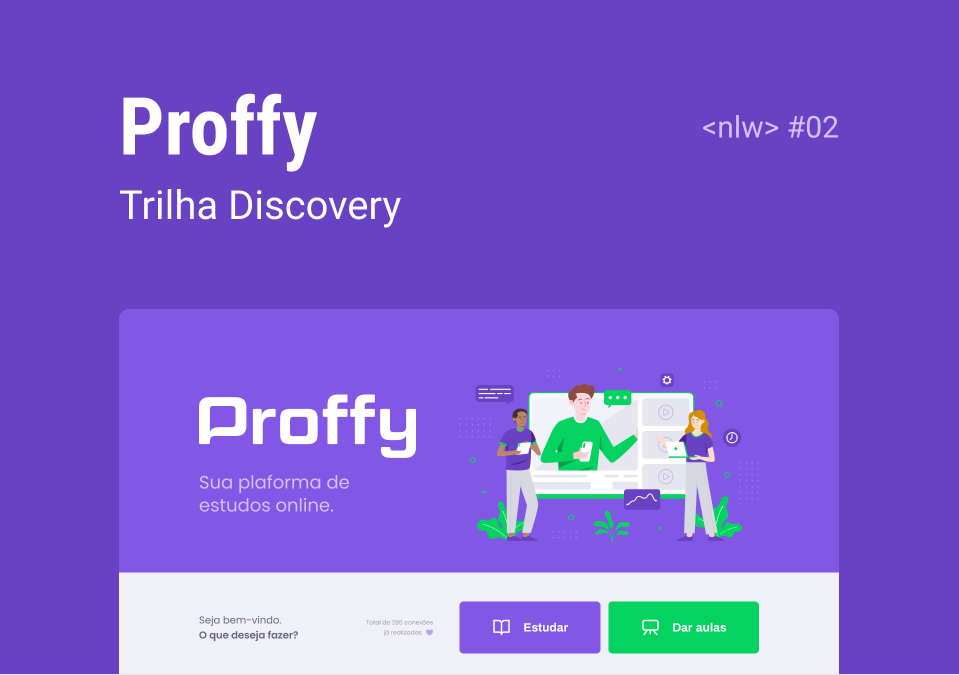

<div align="center">
    <h1>:book: Proffy</h1>
    <p>Your online study platform.</p>
    
</div>


## :scroll: About the project

Proffy is an online study platform created during Next Level Week #2. NLW is an event made available by rocketseat that aims to take devs to the next level.


## :artificial_satellite: Tecnologias

The following technologies were used to develop this project:

- ReactJS - Front-End
    - Typescript

    - React Router Dom

- NodeJS - Back-End

- React Native - Mobile


## :rocket: Test

**You can access this platform by clicking [here](https://proffy-app.netlify.app/).**

ou

### Run project

#### Front-End - Web

1. Clone this repository with ```git clone https://github.com/gersonrocha9/proffy-app.git```

2. Access the project folder with ```cd proffy```

3. Install project dependencies with ```npm install``` ou ```yarn install```

4. Start the project with ````npm start``` ou ```yarn start```

5. If you don't open a web page in your browser, go to ```http://localhost:3000```


## Back-End

1. If you haven't cloned this repository yet, clone it following the 1st step of the front-end.

2. Access the folder ```server```

3. Run ```npm install``` ou ```yarn install``` to install project dependencies.

4. Run ```npm knex:migrate``` ou ```yarn knex:migrate``` to create the database.

5. Start the project with ````npm start``` ou ```yarn start```
